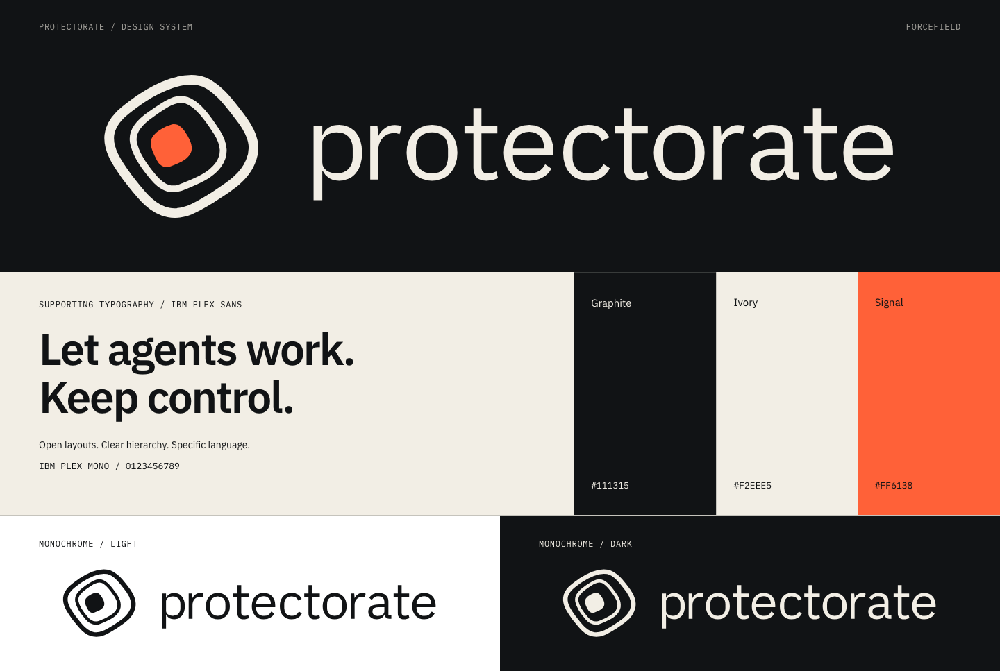

# Protectorate design guide

Use this system for the umbrella company's pages, documents and announcements.
Product interfaces retain their own identities and semantic colors.
The [brand guide](README.md) owns naming, voice and logo rules.

## Color

| Token | sRGB | Role |
| --- | --- | --- |
| Graphite | `#111315` | Primary dark surface; text on light |
| Ivory | `#F2EEE5` | Primary light surface; text on dark |
| Signal | `#FF6138` | Logo core and occasional emphasis |
| White | `#FFFFFF` | Neutral third-party surfaces |

Keep graphite and ivory dominant. Orange draws attention to a useful action or
specific detail; it is not the default background for whole sections. Retain
meaningful product success, warning and error colors.

| Pair | Contrast | Application |
| --- | --- | --- |
| Ivory / graphite | 16.08:1 | Reading, navigation, headings |
| Graphite / signal | 6.22:1 | Text on an orange button or label |
| Signal / ivory | 2.58:1 | Decorative color only; not text or a control boundary |

These are calculated sRGB ratios. Check the actual rendered foreground and
background, including opacity and hover states. Normal text needs at least
4.5:1; large text needs at least 3:1 under
[WCAG's contrast guidance](https://www.w3.org/WAI/WCAG22/Understanding/contrast-minimum.html).
Do not treat a passing palette as proof that an entire interface is accessible.

## Typography

The logo always uses its supplied outlines. Supporting typography uses the
bundled, unmodified IBM Plex families.

| Role | Family / weight | Size / line height | Spacing |
| --- | --- | --- | --- |
| Display | Plex Sans / 600 | 36–72 px / 1.08 | -0.035em |
| Section heading | Plex Sans / 600 | 28–48 px / 1.1 | -0.03em |
| Subheading | Plex Sans / 600 | 20–24 px / 1.25 | -0.01em |
| Body | Plex Sans / 400 | 16–18 px / 1.6 | Normal |
| Metadata | Plex Mono / 400 | 12–14 px / 1.5 | Up to 0.06em for uppercase |
| Code and identifiers | Plex Mono / 400 | 14–16 px / 1.5 | Normal |

Keep prose to roughly 60–70 characters per line. Use sentence case and balanced
headings. Reserve uppercase for short labels. Use tabular numbers for changing
counts, durations and aligned numeric columns.

## Layout

Start from a 4 px spacing unit: 4, 8, 12, 16, 24, 32, 48, 64 and 96 px.
Use 16–24 px between related elements and 48–96 px between sections.

For web layouts, cap the content width at 1200 px. Give it 24 px side gutters
on small screens, growing to 48–80 px on larger screens. Below 700 px, switch
editorial label/content pairs into one column. At 700–1023 px, reduce gaps and
type before compressing the content; at 1024 px and above, allow wider layouts.

Use asymmetry with a clear reading order. A narrow label column and a wider
content column work well for reference material. Do not force unrelated content
into equal cards. Use fine rules to group sections and open space to separate
ideas.

Decorative rules may be subtle; interactive control edges still need visible
contrast. Keep corner radii modest: 4 px for compact elements and 8 px for
panels. For nested rounded containers, the outer radius is the inner radius
plus padding.

## Imagery and product family

Use the Forcefield symbol as an identifier, not a tiled pattern or repeated
background texture. Let it be the organic shape in an otherwise orderly layout.

Show real interfaces, code and workflows when explaining a product. Diagrams
should explain relationships or behavior. Do not invent a dashboard, customer
quote, metric, certification or security outcome to fill space.

Use a quiet “A Protectorate product” endorsement where useful. Keep the product
name visually primary on product-owned surfaces. Emisar's green, for example,
is not replaced by the umbrella's orange.

## Interaction and accessibility

- Make links distinguishable without color alone; underline inline links.
- Keep a visible keyboard focus indicator with contrast against its surface.
- Use at least 44 × 44 px hit areas for primary controls and icon buttons.
- Preserve page meaning and functionality without animation. Respect
  `prefers-reduced-motion`.
- Keep optional transitions around 120–180 ms and name the animated properties.
  Avoid continuous ambient motion and layout-shifting entrances.
- Pair status colors with text or icons. Keep warnings and destructive actions calm.
- Give the company logo “Protectorate” alternative text. Use empty alternative
  text when the mark is decorative beside the same visible name.
- Check reflow at 320 px, keyboard access, 200% text zoom, and desktop/mobile
  light and dark surfaces.

## Implementation assets

[Download the CSS tokens](tokens.css) and [bundled fonts](assets/fonts).
The stylesheet defines fonts and namespaced variables; it does not restyle a
product interface when imported. Apply the tokens intentionally.

The [HTML visual reference](index.html) can be opened locally after downloading
this repository. GitHub displays its source; the Markdown guides and image
above are the readable reference on GitHub.

Before publishing a new application, check the unmodified logo geometry, clear
space, minimum sizes, exact colors, type roles, image loading and responsive
layout. Review the final rendered surface, not only its source.
