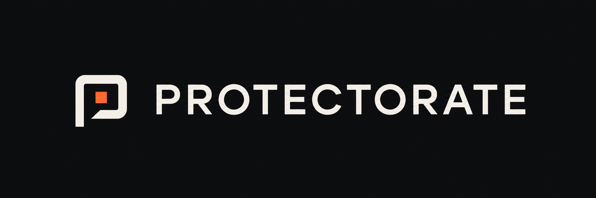
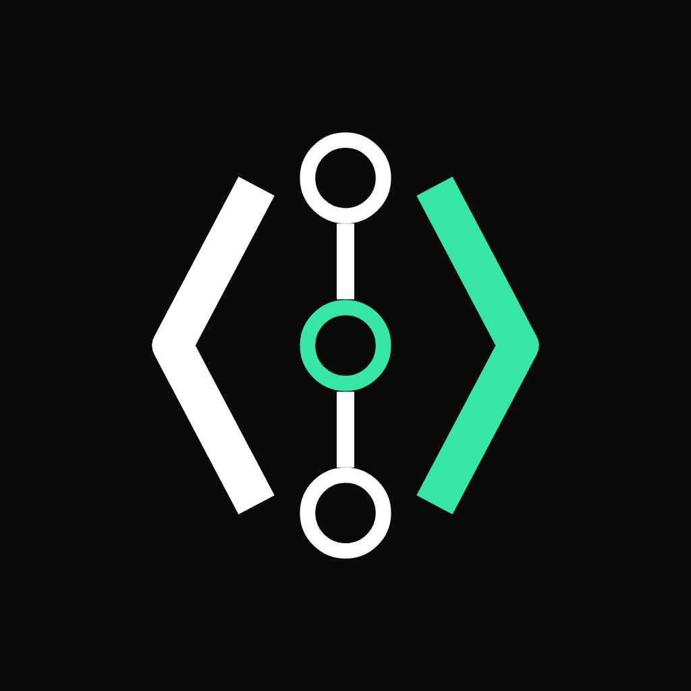

# Protectorate brand guide

Protectorate helps teams put AI to work on their code and systems, while choosing
what it can access and change. The identity pairs the Forcefield symbol with
custom lowercase lettering.

[Design guide](DESIGN.md) · [Logo assets](assets) · [CSS tokens](tokens.css)

## Company and product names

| Context | Name |
| --- | --- |
| Company, headings and prose | Protectorate |
| GitHub organization handle | ProtectorateHQ |
| Products | Coop, Emisar, Ryker |
| Logo artwork | Supplied lowercase protectorate wordmark |

Protectorate is the umbrella company, not a new name for every product. Keep
product names and identities distinct. A small “A Protectorate product”
endorsement can connect a product to the company; it does not imply a required
bundle. Use Ryker in new copy. Where necessary, explain once that it was formerly
called Responder.

When listing the products together, show each product's own mark beside its name.
Keep its original colors and proportions; do not replace it with the Forcefield
symbol. Use equal image boxes and check their visual balance at the displayed size.
On GitHub, keep the mark and its spacing outside the product-name link so the
underline starts at the name, not at the image.

| Product | Current mark | Source |
| --- | --- | --- |
| Coop |  | [Coop's compact website mark](https://github.com/AndrewDryga/coop/blob/main/site/assets/img/favicon.svg) |
| Emisar |  | [Emisar avatar](../profile/assets/emisar-avatar.png) |
| Ryker |  | [Reply logo and usage guide](ryker/README.md) |

## Forcefield symbol

Two closed, softly squared contours surround a separate core. The diagonal
silhouette, offset core and unequal spacing are deliberate.

Use the supplied artwork. Do not rotate the symbol, centre its core, change its
stroke widths, open either contour or join the core to a boundary. Keep glow,
gradients, shadows and extra rings out of the logo. The symbol is a brand
metaphor, not a guarantee that a product prevents every incident.

## Wordmark

The logo lettering has a licensed IBM Plex Sans Regular foundation with wider
round forms, redrawn r and t, and pair-specific spacing. It is custom logo
lettering, not a complete custom typeface.

Use the outlined wordmark or complete lockup. Retyping “protectorate” in Plex
does not reproduce the artwork. Do not change the letter spacing, weight or
symbol-to-name proportions.

## Placement and size

| Application | Rule |
| --- | --- |
| Clear space | At least half the visible core width beyond the visible artwork on every side |
| Complete logo | At least 220 CSS px wide; prefer 320 px or more |
| Standalone symbol | Prefer 24 px or more |
| Symbol below 32 px | Use the supplied optical small variant |
| 16 px favicon | Use the optical variant; this is the smallest supported case |
| Avatar | Use the 512 × 512 composition and retain its full crop |
| Profile banner | Use the 1600 × 520 composition without stretching |

The lockup's transparent canvas is not a substitute for clear space. Apply the
rule beyond the visible artwork. Use the symbol alone when the name would be
too small to read.

On a dark surface, use ivory or ivory/orange. On a light surface, use graphite.
Use the opaque banner when the destination's background is unknown.
[Color specifications and contrast rules](DESIGN.md#color) cover the full system.

## Voice

Write for someone new to these tools: use simple English and explain the useful
work first. Introduce each product by its job, then show how the products work
together through a familiar example. Keep the tone direct, helpful and calm.

- Name the mechanism or product behavior behind a claim.
- Describe controls precisely; avoid blanket safety promises.
- Prefer “AI assistant” to “agent,” “separate environment” to “isolated execution,”
  and “a record of what it did” to “audit trail” in introductory copy. Technical
  documentation can use precise terms once they are explained.
- Use sentence case and keep paragraphs short.
- Keep product capabilities separate. A company-level statement must not imply
  every product provides the same controls.

The company line is “Let AI work. Keep control.” Use it where it introduces
the umbrella, not as a repeated footer on every product explanation.

## Asset library

| Use | File |
| --- | --- |
| Dark-surface primary logo | [lockup-color.svg](assets/lockup-color.svg) |
| Light-surface monochrome logo | [lockup.svg](assets/lockup.svg) |
| Dark-surface monochrome logo | [lockup-reverse.svg](assets/lockup-reverse.svg) |
| Standalone wordmark on light | [wordmark.svg](assets/wordmark.svg) |
| Symbol on light | [mark.svg](assets/mark.svg) |
| Symbol on dark | [mark-reverse.svg](assets/mark-reverse.svg) |
| Ivory/orange symbol on dark | [mark-color.svg](assets/mark-color.svg) |
| Optical small symbol | [Light](assets/mark-small.svg) / [dark](assets/mark-small-reverse.svg) |
| Organization avatar | [PNG](../profile/assets/protectorate-avatar.png) / [SVG](assets/avatar.svg) |
| Organization profile banner | [PNG](../profile/assets/protectorate-banner.png) / [SVG](assets/banner.svg) |

SVGs contain vector outlines and have no runtime font dependency. PNG exports
have opaque graphite backgrounds. Use the supplied sRGB values for digital
work; confirm color with a physical proof for print.

Supporting IBM Plex fonts are bundled unmodified with their
[SIL Open Font License](assets/fonts/LICENSE.txt). The license covers the fonts.

For an organization avatar change, an owner uploads the PNG under
[organization profile settings](https://github.com/organizations/ProtectorateHQ/settings/profile).
GitHub's [profile customization instructions](https://docs.github.com/en/organizations/collaborating-with-groups-in-organizations/customizing-your-organizations-profile)
describe the upload and crop.
