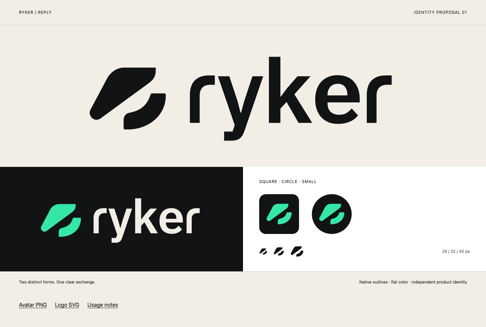

# Ryker — Reply

A finished artwork proposal for Ryker. This set has not replaced the public product identity.

## Files

- [Avatar PNG](avatar.png) — 512 × 512, opaque graphite background; ready for GitHub or Slack upload after selection. Preserve the full crop.
- [Avatar SVG](avatar.svg) — editable source of the same composition.
- [Primary dark-surface logo](lockup-color.svg) — mint symbol and ivory wordmark.
- [Light-surface logo](lockup.svg) — graphite symbol and wordmark.
- [Dark-surface monochrome logo](lockup-reverse.svg) — ivory symbol and wordmark.
- [Symbol](mark.svg) · [mint](mark-mint.svg) · [ivory](mark-reverse.svg).
- [Outlined wordmark](wordmark.svg).
- [Dark banner PNG](banner.png) — 1600 × 540.
- [Visual reference](index.html) — opens locally without external fonts or scripts.

## Use

Keep the two parts separate, with their original orientation and unequal proportions. Do not mirror, rotate, join, outline or add a core. The symbol represents an exchange; it is distinct from Protectorate's enclosing Forcefield mark.

Use the standalone mark at 24 px or more, and the complete logo at 160 px or more. At smaller sizes, increase the available space rather than compressing the artwork. Leave clear space around the visible symbol of at least one eighth of its width. Leave at least one quarter of the wordmark's lowercase height around a complete lockup. The included canvas padding does not replace that surrounding space.

| Color | sRGB |
| --- | --- |
| Graphite | `#111315` |
| Mint | `#36E6A5` |
| Ivory | `#F2EEE5` |

Mint belongs on graphite. Use graphite artwork on white or ivory; do not use mint body text on a light surface. Use the supplied outlined lettering rather than typing the name. Keep names and adjacent marks out of one shared underlined link on GitHub.

## Construction and provenance

The two symbol contours are newly drawn Bézier paths that refine the Reply concept. All shapes use flat fills: no raster images, textures, filters, gradients or external references. PNGs are rendered from these vector files, not retouched generation output.

The lowercase lettering has an IBM Plex Sans SemiBold foundation, with redrawn r shoulders, a slightly widened e and individual spacing for ry, yk, ke and er. It is logo lettering, not a new font. The logo has no runtime font dependency. The source font's [SIL Open Font License](FONT-LICENSE.txt) is included.

This package is a design proposal, not trademark-clearance evidence. Protectorate's approved logo and current product artwork remain unchanged.
